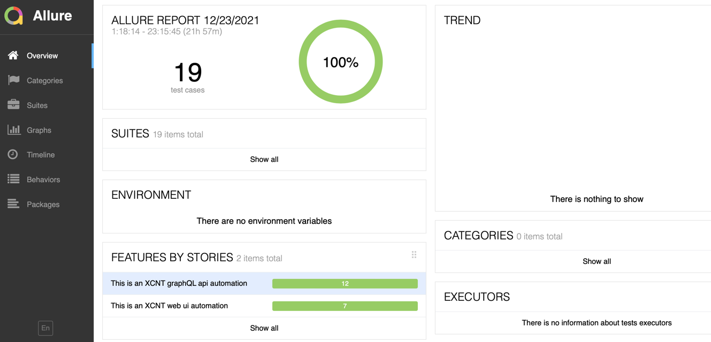

# XCNT Automation Framework(XAF) #

A light weighted BDD framework built using python to perform  WEB and GraphQL API automation.

**Libraries used:**
1. Behave
2. Faker
3. Selenium
4. Rest
5. Allure-behave

**Build Tool:** Behave

### Getting Started ###

### Prerequisites

What you need to install before importing the project.
    Create virtual environment using
``
pip install --user virtualenv
``
and then import the project from the repository. 
After import create the virtual env in the terminal for your favourite IDE, then activate the virtual env and install all the given requirements.
```pythonverboseregexp
python -m virtualenv venv
 
source venv/bin/activate
    
pip3 install -r requirements.txt 
```

### Running the app
Navigate to the project folder location, if the project is located under folder like `/Automation`
   then type:
`behave` and hit enter, this will execute all the feature files with the extension .feature in alphabetic order.
   In case, if you want to run any specific file let's say `api_test.feature` then simply type ``behave features/api_test.feature ``
   same goes for other files.


### Docker
If you have Docker installed, you can also run the app in a Docker container after locating the Automation folder in the terminal:

1. build: `docker build -t xcnt-automation .`
2. run `docker run -d --network="host" xcnt-automation behave features/api_test.feature`
   
    **Note**: if user wants to run all the feature files in a single execution then just type `docker run -d --network="host" xcnt-automation behave`
3. After running above command some random id will be generated like `9b15..` copy this and type `docker logs {random_id}`

In step 2 instead of running or managing the docker-compose file user can run the following commands after creating an image

```buildoutcfg
docker run -d -p 4444:4444 -p 5900:5900 -v /dev/shm:/dev/shm selenium/node-chrome-debug:latest
docker run -d --network="host" xcnt-automation behave   
```
and then type `docker logs {random_id}`

###### Alternate to run docker with some selenium standalone server, if user has `docker-compose.yml`, then the below methodology can be used to execute the framework.
1. Pull docker chrome container `docker pull selenium/node-chrome-debug`
same for firefox `selenium/node-firefox-debug`
2. Install VNC Server using the following link `https://www.realvnc.com/en/connect/download/viewer/`
3. run: `docker-compose -f docker-compose.yml up -d`
4. In VNC server type `localhost:9001` and password will be `secret`

These steps are specially for web automation, but in order to make this successful small alteration is needed, which is not handled by the framework currently. This feature maybe available in the near future.
```buildoutcfg
option = webdriver.ChromeOptions()
driver = webdriver.remote("http://localhost:4444/wd/hub", option)
```

### Reporting
In this framework Allure reports are being used. In order to check and run the allure reports run the following command in the project terminal.
```buildoutcfg
 behave -f allure_behave.formatter:AllureFormatter -o report features/
```
Run the command according to feature file as you did earlier for api type in the last `features/api_test.feature`. Above command will execute all the test cases.

All the data of the report will be stored in the `/report` folder. In order to check and run the report, open the terminal and type the below command.
```buildoutcfg
allure serve {complete_location_from_home}/report  
```

should be look like this.

### References
* Python Faker: https://faker.readthedocs.io/en/master/
* Allure Report: https://docs.qameta.io/allure/
* Behave: https://behave.readthedocs.io/en/stable/tutorial.html
* Web-driver-manager: https://pypi.org/project/webdriver-manager/
* GraphQL API: https://graphql.org/
